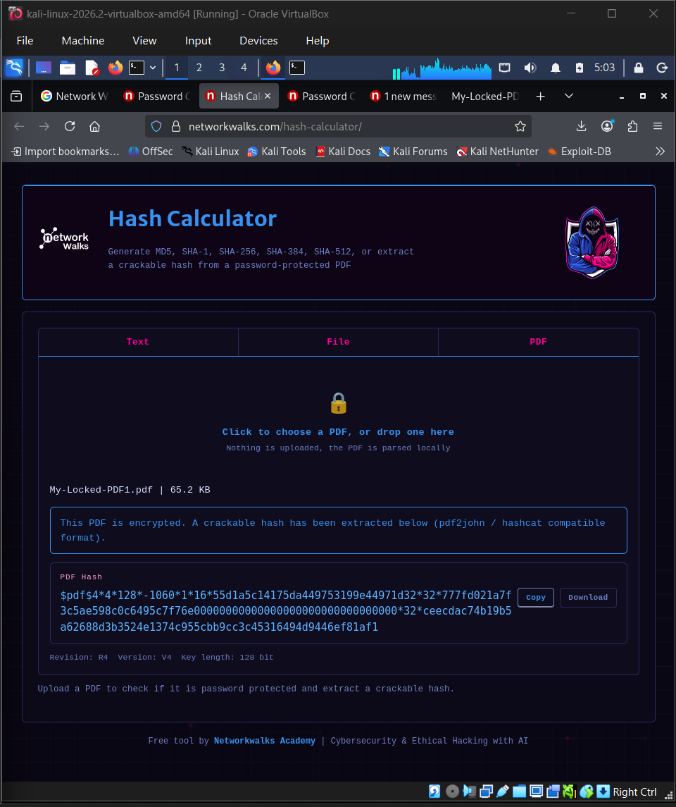
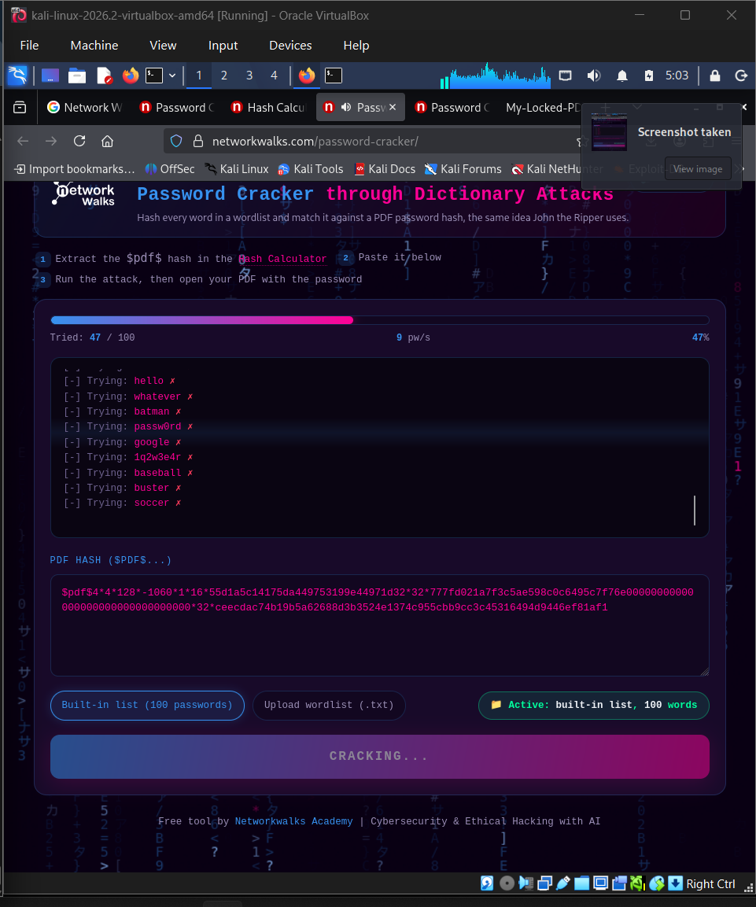
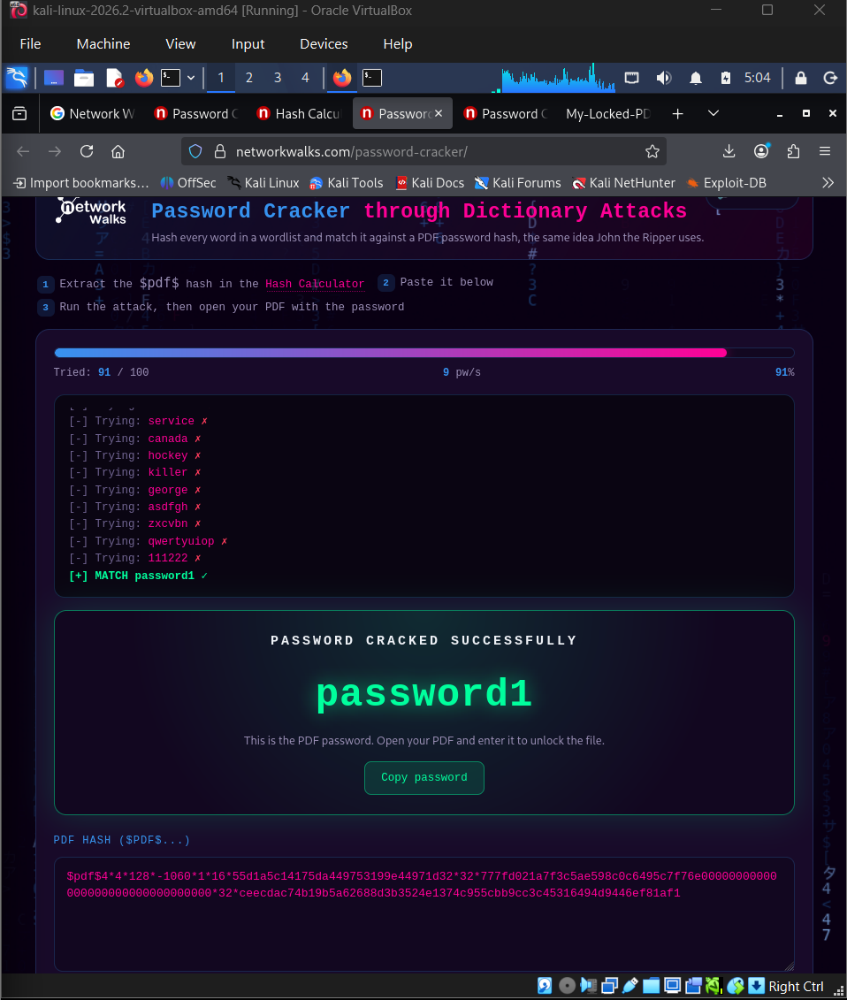

# NETWORKWALKS-BHABANI-B083-WK3-PM2-PASSWORD-CRACKING-NW-TOOLS


## 📌 Project Overview

This repository documents **Week 3 – Project Module 2** of the Networkwalks Cybersecurity & Ethical Hacking internship: cracking the password of an encrypted PDF file using Networkwalks' own browser-based tools — the **Hash Calculator** and **Password Cracker** — no installation required.

## 🎯 Objective

Recover the password of the protected file `My Locked PDF1.pdf` using the Networkwalks Hash Calculator (to extract a crackable hash) and the Networkwalks Password Cracker (to run a dictionary attack against that hash), and understand how password cracking works step by step using purely web-based tools.

## 🛠️ Tools Used

| Tool | Purpose |
|------|---------|
| [Networkwalks Hash Calculator](https://networkwalks.com/hash-calculator/) | Extracts a crackable hash (pdf2john/hashcat compatible format) from a password-protected PDF, entirely in-browser |
| [Networkwalks Password Cracker](https://networkwalks.com/password-cracker/) | Runs a dictionary attack against the extracted `$pdf$...` hash to recover the password |

## 🖥️ Environment

- Any web browser (no installation needed)
- **Target file:** `My Locked PDF1.pdf`

## 📋 Steps Performed

### Step 1: Extract the hash using the Hash Calculator

- Opened [networkwalks.com/hash-calculator/](https://networkwalks.com/hash-calculator/)
- Selected the **PDF** tab and uploaded `My-Locked-PDF1.pdf`
- The tool parsed the file locally in-browser and extracted a crackable hash:

```
$pdf$4*4*128*-1060*1*16*55d1a5c14175da449753199e44971d32*32*777fd021a7f3c5ae598c0c6495c7f76e00000000000000000000000000000000*32*ceecdac74b19b5a62688d3b3524e1374c955cbb9cc3c45316494d9446ef81af1
```

📸 **Screenshot 1** – Hash extracted from the PDF via Hash Calculator


### Step 2: Copy the hash and open the Password Cracker

- Clicked **Copy** to copy the full `$pdf$...` hash
- Opened [networkwalks.com/password-cracker/](https://networkwalks.com/password-cracker/)
- Pasted the hash into the **PDF HASH** field

### Step 3: Run the dictionary attack

- Clicked **START CRACKING**
- The tool ran through its built-in wordlist, trying candidate passwords one by one

📸 **Screenshot 2** – Password Cracker running the dictionary attack (47/100 tried)


### Step 4: Password cracked

- Match found: `[+] MATCH password1`
- Result displayed: **PASSWORD CRACKED SUCCESSFULLY → `password1`**

📸 **Screenshot 3** – Final cracked password result


### Step 5: Unlock the PDF

Opened `My-Locked-PDF1.pdf` and entered `password1` — file unlocked successfully.

## ✅ Result

| File | Recovered Password |
|------|--------------------|
| My-Locked-PDF1.pdf | `password1` |

## 🧠 What I Learned

- How a PDF's password-protection hash can be extracted entirely client-side in the browser (no file ever uploaded to a server), using the same `pdf2john`/`hashcat`-compatible format that JTR uses
- How a dictionary attack works in practice: trying candidate passwords one by one against the target hash until a match is found
- That browser-based tools can achieve the same result as CLI tools like John the Ripper, just with a much smaller built-in wordlist and slower throughput (~9 pw/s vs John's CLI speed)
- Reinforced why common/weak passwords like `password1` are cracked almost instantly regardless of the tool used

## ⚠️ Disclaimer

This exercise was performed strictly for educational purposes as part of the Networkwalks Cybersecurity & Ethical Hacking internship, using a file provided for lab practice. Password cracking techniques should only ever be used on systems/files you own or have explicit written authorization to test.

## 👤 Author

| Field | Detail |
|-------|--------|
| Name | Bhabani Priyadarshini Panda |
| Program | Networkwalks Cybersecurity & Ethical Hacking Internship |
| Batch | B083 |
| Week | Week 3 – Project Module 2 |
| LinkedIn | [linkedin.com/in/bhabani-panda-79a04a308](https://linkedin.com/in/bhabani-panda-79a04a308) |
